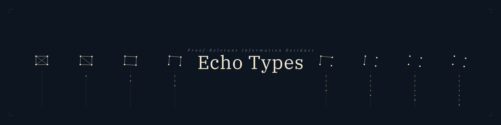

// SPDX-License-Identifier: CC-BY-SA-4.0
// SPDX-FileCopyrightText: 2025-2026 Jonathan D.A. Jewell <j.d.a.jewell@open.ac.uk>
= echo-types
:toc:
:toclevels: 3
:toc-title: Contents

image:https://img.shields.io/badge/OpenSSF-Best_Practices-green?logo=opensourcesecurity[OpenSSF Best Practices,link="https://www.bestpractices.dev/en/projects/new?repo_url=https://github.com/hyperpolymath/echo-types"]
image:https://img.shields.io/badge/License-MPL--2.0-blue.svg[License: MPL-2.0,link="LICENSE"]
image:https://api.thegreenwebfoundation.org/greencheckimage/github.com[Green Web,link="https://www.thegreenwebfoundation.org/green-web-check/?url=github.com"]

Constructive Agda development for echo types as a first-class notion of structured loss:

loss that is not total erasure.

[quote]
____
*Executable companion.* link:https://github.com/hyperpolymath/EchoTypes.jl[`hyperpolymath/EchoTypes.jl`]
(v0.2.0, 2026-05-27) runs the finite-domain shadow of the Tier-1 +
Tier-2 spine + the unconditional F5 OFS fragment on concrete data.
The Julia mirror is honestly scoped under R-2026-05-18 — it does
NOT replay the retracted graded-comonad / two-models / UP /
conservativity surface, nor the funext-qualified F5 clauses (Julia
has no funext). It falsifies-by-counterexample; the Agda here
remains the source of truth.
____

== 🗺️ Where things are

*New here, or can't find something? Start with the
link:docs/echo-types/MAP.adoc[Master Map].* It is the single source of
truth for every direction (Thermodynamic, Buchholz/Veblen ordinals,
Characteristic/EI, CNO/absolute-zero, JanusKey, Tropical/Dyadic, MAA,
Shannon — and ArghDA tooling), each status-tagged and back-linked to
its proofs and docs, with the retraction/proof-debt governance called
out. The scattered overview/roadmap docs are detail under it.

== 📐 Structural overview

[source,mermaid]
----
flowchart TD
    F["<b>Foundation</b> Echo f y := Σ (x : A) , (f x ≡ y) = homotopy fibre"]
    AD["<b>Pillars A–D</b> (establishment plan, LANDED 2026-05-17) A: echo↔fib · B: pullback UP · C: separating model · D: carrier-parametric"]
    PF["<b>Pillar F gates</b> (earn-back, ALL PASSED) F1: graded-comonad witness · F2: 2nd Echo-functor model F3: 2nd non-iso grade-monoid · F4: funext-qualified pullback UP F5: funext-qualified full OFS"]
    T1["<b>Tier 1 · Canonical identity layer</b> (2026-05-27, extended 2026-05-28) EchoTotalCompletion (A ≃ Σ B Echo f) · OFS-witness · Image · no-section-of-collapsing-map · ImageFactorizationProp (epi,mono earn-back)"]
    T2["<b>Tier 2 · Classification grid</b> LossTaxonomy (function-side) · ResidueTaxonomy (residue-side, 8 instances incl. Indexed, Cost, Search, Epistemic) · DecorationStructure · _≡m_"]
    T3["<b>Tier 3 · Qualified universal property</b> (Gate F5) echo-factorisation-strict · diagonal lifting · factorisation uniqueness up to iso"]
    AUD["<b>Audience surfaces</b> EchoProvenance · EchoSecurity · EchoProbabilisticSupport · EchoDifferential"]
    SUITE["<b>EchoCanonicalIdentitySuite</b> (curated single-file entry point)"]

    F --> AD
    AD --> PF
    F --> T1
    T1 --> T2
    T2 --> T3
    PF -.->|F5 underpins| T3
    T1 --> AUD
    T2 --> AUD
    T3 --> AUD
    T1 --> SUITE
    T2 --> SUITE
    T3 --> SUITE
    AUD --> SUITE
----

The diagram above renders on GitHub; for terminal viewers an ASCII
version of the same stack:

----
┌─────────────────────────────────────────────────────────────────┐
│  EchoCanonicalIdentitySuite   ← curated single-file entry        │
├─────────────────────────────────────────────────────────────────┤
│  Audience surfaces:                                              │
│  Provenance · Security · ProbabilisticSupport · Differential     │
├─────────────────────────────────────────────────────────────────┤
│  Tier 3 (Gate F5, funext-qualified):                             │
│  F5-1 strict triangle · F5-2 diagonal lifting · F5-3 uniqueness  │
├─────────────────────────────────────────────────────────────────┤
│  Tier 2 (classification grid):                                   │
│  LossTaxonomy · ResidueTaxonomy · DecorationStructure · _≡m_     │
├─────────────────────────────────────────────────────────────────┤
│  Tier 1 (canonical identity layer):                              │
│  TotalCompletion · OFS · ImageFactorization · NoSectionGeneric   │
├─────────────────────────────────────────────────────────────────┤
│  Pillar F gates F1–F5  (earn-back ledger, ALL PASSED)            │
├─────────────────────────────────────────────────────────────────┤
│  Pillars A–D  (establishment plan, LANDED 2026-05-17)            │
├─────────────────────────────────────────────────────────────────┤
│  Foundation: Echo f y := Σ (x : A) , (f x ≡ y)                   │
└─────────────────────────────────────────────────────────────────┘
----

*The headline factorisation* (Tier 1 + Pillar F Gate F5):

----
                  encode f
        A ────────────────────→ Σ B (Echo f)
         ╲                            │
          ╲                           │
         f ╲                          │ proj₁
            ╲                         │
             ╲                        │
              ╲                       ↓
               ────────────────────→ B

      Left leg  (encode f) :  EQUIVALENCE          ← EchoTotalCompletion.A↔ΣEcho
      Right leg (proj₁)    :  PROJECTION
      Triangle             :  f ≡ proj₁ ∘ encode f ← strict given funext (F5-1)
                                                    pointwise definitional otherwise
----

This is *the* structural fact the repo establishes: every irreversible
`f` factors canonically through its total Echo space, with the left leg
an equivalence (the _slogan-unlock_) and the right leg a projection.
Under `--safe --without-K` the factorisation existence + fibre
identification (`ofs-witness`) are unconditional; the function-level
universal-property clauses are earned back under Pillar F Gate F5
(`funext` as explicit module parameter, never a postulate).

== 📖 Recommended reading order

For someone landing here for the first time and wanting the full arc:

. *link:docs/echo-types/MAP.adoc[`docs/echo-types/MAP.adoc`]* — the
  master content map, status-tagged.
. *link:proofs/agda/EchoCanonicalIdentitySuite.agda[`proofs/agda/EchoCanonicalIdentitySuite.agda`]* —
  the curated single-file Agda entry point, re-exporting every
  load-bearing headline from Tier 1, Tier 2, Tier 3, and the
  audience surfaces.
. *link:docs/echo-types/universal-property.adoc[`docs/echo-types/universal-property.adoc`]* —
  the categorical-universal-property story end-to-end (pullback +
  F4 + F5 / OFS), with the diagrams above as the spine.
. *link:docs/echo-types/fibration-package.adoc[`docs/echo-types/fibration-package.adoc`]* —
  the fibration-side companion (`map-over` + composition +
  cancellation + pentagon).
. *link:docs/echo-types/paper.adoc[`docs/echo-types/paper.adoc`]* —
  the long-form Pillar E paper (LIVING DRAFT with `[EXPAND]` tags;
  §"Post-establishment structural extensions" weaves the
  2026-05-27 Tier-1+2+3 spine into the central argument).
. *link:docs/retractions.adoc[`docs/retractions.adoc`]* +
  *link:docs/echo-types/earn-back-plan.adoc[`docs/echo-types/earn-back-plan.adoc`]* —
  honesty layer: R-2026-05-18 narrowing + Pillar F gate ledger
  (F1–F5 ALL PASSED).
. *link:CLAUDE.md[`CLAUDE.md`]* — the session-by-session ledger
  for what got built when (read after the canonical docs).

== Core Idea

Most formalisms foreground two clean cases:

* reversible / injective / linear-ish: no important loss
* ordinary irreversible: loss occurs and is usually forgotten

Echo types target a third case:

* irreversible, but with a retained proof-relevant constraint on what was lost

This repository treats that third case as the primary object of study.

== Semantic Fibre Vocabulary

Echo Types are a way to talk about structured loss under a declared
crossing, degradation, observation, compression, translation, or other
non-injective map. They are not a replacement for ordinary type
checking, ABI proofs, FFI discipline, typed-wasm, structural-fit
systems, or any boundary system that can preserve exact guarantees.
When exact preservation is available, use it.

The additional vocabulary is for cases where the value that crosses the
boundary is no longer the original guarantee, but is also not
meaningless:

* A *semantic fibre* is the structured set, approximation, or witness
  of possible typed origins lying over an observed artefact under the
  declared map. In the current Agda kernel, this is the preimage fibre
  `Echo f y := Σ (x : A) , (f x ≡ y)`.
* *Avec fibre* means the artefact carries, or is accompanied by,
  enough semantic fibre to support the inferences or uses being made.
* *Sans fibre* means the artefact is only a valid target-side value:
  no meaningful possible-origin structure is retained or declared.
* The *echo* is the surviving transformed signal or constraint after
  loss. A *warrant* is the licence that echo/fibre gives for an
  inference or operation; the public surface usually talks about echoes
  and fibres rather than making warrant the headline term.

This distinguishes semantic fibre from nearby history words.
Provenance says where something came from; trace or lineage says how it
got here; residue says what lower-level evidence remains after a
degradation; semantic fibre says what possible origins still lie over
the observation. The useful formulation is therefore not "loss became
total erasure", but "loss left a declared fibre, and that fibre may or
may not be informative enough for the intended use".

Terminology note: "fibre" aligns productively with the mathematical
preimage/homotopy-fibre reading. Where ambiguity with CS fibers
(lightweight threads) or network fibre matters, say *semantic fibre*
or *preimage fibre*.

Applied sketch: link:docs/echo-types/prototypes/warrant_debugger_prototype.jsx[`docs/echo-types/prototypes/warrant_debugger_prototype.jsx`]
is a React prototype for the warrant/debugging layer of this vocabulary.
It starts with a contradictory empty fibre and shows repair choices
that weaken, widen, or soften the active obligations while keeping the
epistemic cost visible. It belongs to the explanatory layer, not the
formal kernel: it demonstrates how a tool could present the warrant
provided by a fibre without turning "warrant" into the project headline.

== Repository Map and Boundaries

The repo is not being physically split by this vocabulary; the existing
shape already separates the roles well enough:

* *Theoretical/formal core:* Agda definitions, characteristic theorem
  families, canonical identity layer, and falsifiability gates under
  `proofs/agda/`, `roadmap-gates.adoc`, and the retraction ledger.
* *Applied/explanatory layer:* taxonomy, examples, tutorials,
  boundary/degradation use cases, and audience-facing terminology under
  `docs/echo-types/` and `tutorial/`. Doc-side UI sketches live under
  `docs/echo-types/prototypes/`.
* *Executable companion layer:* link:https://github.com/hyperpolymath/EchoTypes.jl[`EchoTypes.jl`]
  is the finite-domain Julia companion. It computes runnable shadows of
  selected Agda constructions; it is not the proof source.
* *Language-embodiment layer:* link:https://github.com/hyperpolymath/ephapax[`Ephapax`]
  is a separate language project in which Echo Types are intended to
  become an embodied language-level design principle. Its current docs
  discuss an L3 echo/residue layer (for example, `STATUS.adoc` and
  `EXPLAINME.adoc`). Ephapax is an application/consumer, not the
  definition of the formalism, and this repo does not depend on it.

== Definition (Foundation)

Given `f : A → B`, define the fiber/echo at `y : B`:

`Echo f y := Σ (x : A) , (f x ≡ y)`

Current formal foundation is in:

* `proofs/agda/Echo.agda`
* `proofs/agda/EchoCharacteristic.agda`
* `proofs/agda/EchoResidue.agda`
* `proofs/agda/EchoExamples.agda`
* `proofs/agda/EchoChoreo.agda`
* `proofs/agda/EchoEpistemic.agda`
* `proofs/agda/EchoLinear.agda`
* `proofs/agda/EchoGraded.agda`
* `proofs/agda/EchoTropical.agda`
* `proofs/agda/EchoIntegration.agda`

with constructive proofs (`--safe --without-K`, no postulates in `proofs/agda`):

* `echo-intro` (introduction into own fiber)
* `map-over` (action on fibers for morphisms over fixed base)
* `map-over-id` (identity law)
* `map-over-comp` (composition law)
* `map-square` (action along commuting squares)

== Canonical identity layer (2026-05-27)

The named-theorem load-bearing artefacts that promote Echo from a
useful construction to a _named_ structural object — the canonical
fibre-completion functor plus one leg of the (equivalence,
projection) orthogonal factorisation system on Type. *Read
link:docs/echo-types/MAP.adoc[`docs/echo-types/MAP.adoc`] §"Canonical
identity layer" for the full status-tagged listing; this section
is the README-side hook.*

Single-file curated entry point:
link:proofs/agda/EchoCanonicalIdentitySuite.agda[`proofs/agda/EchoCanonicalIdentitySuite.agda`]
re-exports every load-bearing headline under the suite-side index.

Tier 1 (the canonical identity layer itself):

* `proofs/agda/EchoTotalCompletion.agda` — `A ≃ Σ B (Echo f)` (the slogan-unlock)
* `proofs/agda/EchoOrthogonalFactorizationSystem.agda` — `ofs-witness` (the OFS witness at the K-free level)
* `proofs/agda/EchoImageFactorization.agda` — `Image f := Σ B (Echo f)` (image factorisation in Echo language)
* `proofs/agda/EchoNoSectionGeneric.agda` — `no-section-of-collapsing-map` (the structural no-section theorem)

Tier 2 (the classification grid — kinds-of-loss × shapes-of-residue):

* `proofs/agda/EchoLossTaxonomy.agda` — four-axis function-side classification (EQUIV / INJ / SURJ / CONST)
* `proofs/agda/EchoResidueTaxonomy.agda` — `ResidueForm` record + four instances
* `proofs/agda/EchoDecorationStructure.agda` — `DecorationStructure` record (seven-field recipe) + four instances + abstract degrade-compose
* `proofs/agda/EchoObservationalEquivalence.agda` — mode-indexed equality `_≡m_` on `LEcho`

Tier 3 / Pillar F Gate F5 FULL PASS (2026-05-27, qualified OFS earn-back):

* `proofs/agda/EchoOFSUnivF5.agda` — F5-1 strict factorisation triangle (funext-qualified)
* `proofs/agda/EchoOFSUnivF5Diag.agda` — F5-2 diagonal lifting property
* `proofs/agda/EchoOFSUnivF5Iso.agda` — F5-3 factorisation uniqueness up to iso

Audience-facing surfaces (each ships `record + parametric headline theorems + worked instance + honest-bound matched-negatives`):

* `proofs/agda/EchoProvenance.agda` — database / lineage audience
* `proofs/agda/EchoSecurity.agda` — region-exit / capability-flow audience (generalises `tutorial/region_exit_audit/`)
* `proofs/agda/EchoProbabilisticSupport.agda` — sampling / draw-id audience
* `proofs/agda/EchoDifferential.agda` — sensitivity / perturbation-tracking audience

Cementing matched-negatives (shadow encodings that provably don't substitute for Echo):

* `proofs/agda/EchoEntropy.agda` — Shannon-entropy non-distinguishing theorem
* `proofs/agda/EchoLLEncoding.agda` — LL `!A := 1` shallow-encoding gap

Consolidation narratives:

* link:docs/echo-types/universal-property.adoc[`docs/echo-types/universal-property.adoc`] — pullback + F4 + F5 / OFS arc end-to-end
* link:docs/echo-types/fibration-package.adoc[`docs/echo-types/fibration-package.adoc`] — map-over + composition + cancellation + pentagon arc

Pillar F gate ledger + retraction follow-ups:
link:docs/echo-types/earn-back-plan.adoc[`docs/echo-types/earn-back-plan.adoc`]
(gates F1–F5, all PASSED) +
link:docs/retractions.adoc[`docs/retractions.adoc`] (R-2026-05-18 +
follow-ups F-2026-05-18a, F-2026-05-20a/b, F-2026-05-27a).

Characteristic M2 results include:

* explicit non-injectivity witnesses for collapse maps
* impossibility of full reconstruction from plain visible output (`no-section-*` family)
* distinct echoes over the same visible value (`echo-true≢echo-false`, `stateA≢stateB`)
* retained-constraint theorem for projection-style structured loss (`visible-constraint`)

Scope-broadening stages now include:

* choreographic bridge (`RoleEcho` over role projections, commuting-square transport)
* epistemic bridge (indistinguishability and echo-indexed knowledge)
* affine/linear bridge (strict weakening from full echoes to residues)
* graded bridge (grade order and compositional degradation law)
* tropical bridge (argmin-style witness residues under tropical collapse)
* integration bridge (cross-decoration commutation via the recipe; the recipe is useful as organising vocabulary but does not carry substantive simultaneous integration content — see `docs/EI2_REPORT.adoc`. Distinctness rests on truncation and 2-cell arguments)
* indexed/relational/categorical packaging (`EchoIndexed`, `EchoRelational`, `EchoCategorical`, `EchoScope`)
* cross-ecosystem bridges (`EchoCNOBridge`, `EchoJanusBridge`, `DyadicEchoBridge`, `EchoOrdinal`)

== Current Status Snapshot

The repository runs *two parallel, independent tracks*. _Echo Core does
NOT depend on the Ordinal / Buchholz track._ A reader interested only
in echo types as a type-theoretic concept can ignore the Ordinal track
entirely; it lives in `proofs/agda/Ordinal/` and is documented under
`roadmap.adoc` §Lane 3.

=== Echo Core (load-bearing for the identity claim)

On `main`, the following are true:

* full suite compiles: `agda -i proofs/agda proofs/agda/All.agda`
* core echo/fiber laws are smoke-pinned (`echo-intro`, `map-over`, `map-over-id`, `map-over-comp`, `map-square`)
* non-injectivity/no-section family is present (`collapse-non-injective`, `no-section-collapse`, `no-section-visible`, `no-section-collapse-to-residue`, `no-section-weaken`)
* distinct-witness and retained-constraint exemplars are present (`echo-true≢echo-false`, `stateA≢stateB`, `visible-constraint`)
* degrade-law family lands across decoration layers (graded, linear/affine, choreographic, access, cost, search); see `docs/theorem-index.md` for the aggregate
* Pillars A–D of the establishment plan are LANDED (with R-2026-05-18 narrowings; see `docs/retractions.adoc`); Pillar E (paper) is in progress
* Pillar F gates F1–F5 all PASSED (F1 graded-comonad-witness; F2 Echo-functor second model; F3 second non-isomorphic grade-monoid; F4 funext-qualified pullback UP; F5 funext-qualified full OFS — F-2026-05-27a)
* Canonical identity layer + Tier-2 grid + audience surfaces LANDED 2026-05-27 (see "Canonical identity layer" section above + `EchoCanonicalIdentitySuite.agda` for the curated entry point)
* Lane 5 tutorial triplet LANDED 2026-05-27 under `tutorial/`: region-exit audit, epistemic erasure, and provenance / debugging — each with honest-bound + matched-negative disclosure discipline; build via `agda --library-file=/tmp/agda-libs -i . -i proofs/agda tutorial/All.agda`

Per-lane status, close-out criteria, and the identity-claim verdict
per tag are in `roadmap.adoc`.

=== Ordinal / Buchholz (parallel-independent, experimental)

[NOTE]
====
*Banner.* This track is a separate proof-theoretic research project
living in the same repository. Echo Core does not depend on it.
Modules under `proofs/agda/Ordinal/` are treated as *experimental*
until the unbudgeted `wf-<ᵇʳᶠ_` closure lands. See `roadmap.adoc`
§Lane 3 for status and close-out criterion; `docs/buchholz-plan.adoc`
for the full plan.
====

Current state (one-line summary; the full per-rung ledger lives in
CLAUDE.md):

* `Ordinal.Buchholz.WellFounded` provides `wf-<ᵇ : WellFounded _<ᵇ_` for the currently admitted constructor core
* top-marker `bplus` bridges are admitted and inverted: `<ᵇ-+ω`, `<ᵇ-+ψω`, `<ᵇ-inv-+Ωω`, `<ᵇ-inv-+ψω`
* left-summand bridges into additive terms are admitted and inverted: `<ᵇ-Ω+`, `<ᵇ-ψ+`, `<ᵇ-inv-Ω+`, `<ᵇ-inv-ψ+`
* general additive-target bridges are admitted and inverted: `<ᵇ-+Ω`, `<ᵇ-+ψ`, `<ᵇ-inv-+Ω`, `<ᵇ-inv-+ψ`
* `Ordinal.Buchholz.VeblenInterface` pins the measure-based WF interface with explicit constructor obligations; the historical same-binder fields (`dec-ψα`, `dec-+2`) remain part of the generic interface, but the closed comparison route now discharges them internally
* `Ordinal.Buchholz.VeblenMeasureTarget` fixes a first concrete target carrier: a lexicographic order on `OmegaIndex × BT`
* `Ordinal.Buchholz.VeblenProjectionMeasure` is retained as an explanatory scaffold: it makes the projection-style measure into that target explicit and discharges the shared-binder obligations there as target lemmas
* `Ordinal.Buchholz.VeblenComparisonTarget` adds a second concrete target: a lexicographic order on `BT × Payload` with recursive `ψ`-compatibility on the first coordinate and tagged payload descent for the same-binder follow-up cases
* `Ordinal.Buchholz.VeblenComparisonModel` is now the primary closed Veblen route: it instantiates the Veblen interface without deferred assumptions and exposes `core-wf-from-comparison : WellFounded _<ᵇ_`
* `Ordinal.Buchholz.ExtendedOrder` now packages a closed comparison-induced extension `_ <ᵇ⁺ _` of `BT`: it contains the current core, exposes the historical same-binder principles as lemmas, and is transitive and well-founded
* `Ordinal.Buchholz.LiftedExtendedOrder` now adds the next honest wrapper `_ <ᵇ⁺¹ _`: the blocked self-lift of `_ <ᵇ⁺ _` fails, but same-binder moves from `_ <ᵇ⁺ _` into `_ <ᵇ⁺¹ _` are derivable and `_ <ᵇ⁺¹ _` is well-founded
* `Ordinal.Buchholz.IteratedExtendedOrder` now packages that repair as a finite iteration scheme: `LiftedOrder n` gives the `n`th wrapper layer, same-binder moves lift one level at a time, and exact finite same-binder depth is tracked by `SurfaceDepth n` with an embedding into `LiftedOrder (suc n)`
* `Ordinal.Buchholz.SurfaceOrder` now adds a direct inductive surface `_ <ᵇˢ _` for the two historical same-binder shapes, with an embedding into `_ <ᵇ⁺ _` and inherited well-foundedness
* `Ordinal.Buchholz.RecursiveSurfaceOrder` now adds a genuinely recursive finite-closure candidate `_ <ᵇʳᶠ _`: every derivation extracts an exact finite depth and embeds into `LiftedOrder (suc n)`, so irreflexivity follows without requiring a single self-stable wrapper
* `Ordinal.Buchholz.RecursiveSurfaceBudget` now packages the next accepted recursion vehicle: a budgeted relation on `ℕ × BT` whose first coordinate strictly decreases and which still carries the lifted witness into the iterated wrapper tower
* the exact remaining recursive frontier is now explicit in code as a blocked self-lift: `SurfaceLiftInterface` is refuted by a concrete same-left `bplus` counterexample, and the surviving route is finite wrapper iteration rather than self-stability
* the Veblen comparison route is now closed for the current admitted constructor core
* the new `_ <ᵇ⁺ _` wrapper advances the full-order line by giving a mediated closed relation on all terms
* the new `_ <ᵇˢ _` surface is the first direct bridge candidate between the current core presentation and that mediated wrapper
* the new `LiftedOrder n` / `SurfaceDepth n` family shows that arbitrary finite same-binder depth can already be handled by iterated mediated wrappers
* the new `_ <ᵇʳᶠ _` candidate shows that direct recursive derivations also reduce to those finite-depth fragments; what is still open is a single global mediated well-foundedness theorem for that union
* the new budgeted layer on `ℕ × BT` isolates the missing global step: the recursive surface route is now well-founded once explicit budget is carried, and the remaining task is to discharge or eliminate that budget in the unbudgeted theorem
* 2026-05-28 ordinal-track progress: Slice 3 (`rank-mono-<ᵇ-+1-via-head-Ω` headline under a strict-head premise) closed via PRs #141–#143; Slice 4 narrowed umbrella `_<ᵇ⁻ⁿ_` (covering all 10 inherited `_<ᵇ⁰_` cases plus the strict-head joint-bplus) closed via PR #149 (`RankMonoUmbrellaSlice4`); rank-lex pivot scaffold for the bpsi-source-at-equality sub-case landed via PR #147 (`RankLexJointBplus`). Two constructor-level shortfalls remain pinned as `⊤`-aliases: `<ᵇ-ψΩ≤` boundary (closes at lex-rank level only) and `<ᵇ-+1` at equal-head (gated on `RankLexJointBplus`-pivot completion). The unbudgeted `_<ᵇʳᶠ_` global WF and full-order internalisation into `Order.agda` remain open.
* this still does not internalize the historically blocked shared-binder shapes as actual constructors of `_ <ᵇ _`; the full intended Buchholz order remains open at that step
* remaining live mathematical work is therefore not the current-core WF route, but the mediated internalization of the shared-binder cases back into the real order package
* as of 2026-05-27: the Buchholz rank-monotonicity matrix closes 11/13 constructor cases via the WfCNF-restricted `_<ᵇ⁻_` umbrella (9 via `RankPow` + `<ᵇ⁺-ψα` via `RankAdm` 2026-05-26 + `<ᵇ-ψΩ≤` via `RankLex` 2026-05-27); the last open case is `<ᵇ-+1` joint-bplus, with the `Ordinal.Buchholz.HeadOmega` first slice (leading-Ω-index head function + 4 definitional sanity lemmas) landed 2026-05-27 as the structural opening of option (A) per the obstruction doc

== External Bridge Targets (local workspace)

Current bridge targets in this workspace are:

* `absolute-zero`: `/var/mnt/eclipse/repos/verification-ecosystem/maa-framework/absolute-zero`
* `januskey`: `/var/mnt/eclipse/repos/developer-ecosystem/januskey`
* `tropical-resource-typing` (potential target, not recently audited): `/var/mnt/eclipse/repos/verification-ecosystem/tropical-resource-typing` (upstream: `https://github.com/hyperpolymath/tropical-resource-typing`)

Note: `januskey` is not currently nested under `maa-framework` in this workspace layout.

Cross-repo status:

* bridge formalisms live in this repo (`EchoCNOBridge`, `EchoJanusBridge`, tropical-collapse witness work in `EchoTropical`)
* Agda-side content-bridge `proofs/agda/EchoCNOBridge.agda` imports `IsCNO` directly from `absolute-zero/proofs/agda/CNO.agda` (the earlier scaffolded-adapter plan `EchoBridgeScaffold.agda` was superseded)
* end-to-end conformance against upstream codebases is a separate track and is not yet fully machine-checked here
* current bridge ledger: `docs/echo-types/cross-repo-bridge-status.md`
* see `roadmap.adoc` (Lane 4) for staged cross-repo verification gates

== What Echo Types Are For

Echo types are useful when outputs are:

* insufficient to reconstruct their source exactly
* still sufficient to constrain the source non-trivially

Intended proof-use cases include:

* non-injective computation
* provenance
* structured irreversibility
* partial recoverability
* classification up to equivalence
* forensic inference from residues
* refined taxonomies of information loss

Within the hyperpolymath ecosystem, echo-types serves the _foundation_
role for proof-relevant lossy computation.

Who is this for? (folded from `EXPLAINME.adoc` at the 2026-06-12 README dedup)

* Authors of formally-verified protocols where role projections /
  privacy collapses / lossy aggregations need typed witnesses for what
  was retained.
* Authors of refinement-typed and graded type systems looking for a
  foundational vocabulary for loss-with-residue.
* Anyone designing audit / provenance / hash-chain systems who wants a
  proof-relevant account of what the audit step preserves.

== Foundation Contract (for downstream languages)

If you are wiring Echo into another language (e.g. my-lang), the stable
entry point is *`FOUNDATION_CONTRACT.md`* plus the curated `Echo.*`
namespace under `proofs/agda/Echo/`. It re-exports the proven core behind
a small, documented surface so you depend on the contract, not the research
sprawl:

[cols="1,2"]
|===
|Concern |Module

|Echo index (thin poset `keep ≤ residue ≤ forget`)
|`Echo.Index.ThinPoset`

|Echo modality (`degrade`, `degrade-id`, `degrade-compose`, no-section) — *measure-independent*
|`Echo.Modality.Core` / `.Interface`

|Anti-collapse separation
|`Echo.Separation.NotResourceInstance`

|Residue-measure observation seam (cost / tropical / confidence)
|`Echo.Measure.Interface` / `.Examples`
|===

*Boundary invariant — `Echo IS-NOT a resource instance`.* Echo is an
orthogonal indexed/residual modality. A resource algebra may _measure_ Echo
residues, but it does not _define_ Echo: *equal residue measure does not
imply equal Echo* (mechanised: `equal-measure-does-not-imply-equal-echo`,
`measure-not-injective`). Do *not* model Echo as a `Soundness(S)`
resource-algebra instance. Vocabulary: _resource grade_ (semiring axis) ≠
_echo index_ (modality index) ≠ _residue measure_ (a lossy observation);
avoid "echo-grade".

== Identity Claim and Falsifiability

This repo is trying to establish echo types as a concept with its own identity.
Since `Echo` is built from sigma/fiber machinery, identity will not come from syntax.
It must come from role and theorems.

We treat the claim as established only if all three are met:

. Distinct phenomenon: structured loss under non-injective computation.
. Characteristic theorem family: results that are naturally echo-shaped, not just generic sigma lemmas.
. Canonical examples: cases where echo type is the right explanatory unit.

If these fail, we record that result and stop the identity claim.

== Build

[source,bash]
----
cd /var/mnt/eclipse/repos/echo-types
agda -i proofs/agda proofs/agda/Echo.agda
----

Full suite:

[source,bash]
----
cd /var/mnt/eclipse/repos/echo-types
agda -i proofs/agda proofs/agda/All.agda
----

=== Installing as a library

The repo is structured as an Agda library via `echo-types.agda-lib`
at the repo root. To use `echo-types` from another Agda project,
register the library file once:

[source,bash]
----
git clone https://github.com/hyperpolymath/echo-types.git
echo "$(pwd)/echo-types/echo-types.agda-lib" >> ~/.agda/libraries
----

Then in any other project, depend on `echo-types` in that
project's own `.agda-lib`:

----
name: my-project
depend: standard-library echo-types
include: src
----

=== Usage

Consumers can then `open import Echo`, `open import EchoLinear`,
or `open import tutorial.region_exit_audit.RegionExitAudit` — the
library's `include:` line covers both `proofs/agda` and the repo
root (for the Lane 5 tutorial track).

Requires `standard-library` v2.3 or later registered alongside.

== Citation

If you cite this repository in academic work, please cite via the
Zenodo DOI listed in link:CITATION.cff[CITATION.cff]. The Zenodo
record is the canonical citation target; GitHub's "Cite this
repository" widget resolves directly to it.

GitHub→Zenodo integration is a one-time author setup; until that
is wired the `CITATION.cff` `doi:` field carries a placeholder
(`10.5281/zenodo.0000000`). See
link:docs/echo-types/pillar-e-offline.adoc[docs/echo-types/pillar-e-offline.adoc]
§"Zenodo DOI mint" for the activation sequence.

== Tooling Stance

* default development stays plain Agda with the standard library
* optional exploratory work may use Agda's built-in `--cubical` mode plus the separate Cubical Agda library
* adjacent cubical systems such as `RedPRL`, `redtt`, and `cooltt` are tracked as references, not as active proof infrastructure for this repo
* see `roadmap.adoc` (`R2`) and `docs/adjacency/cubical-systems.adoc`

== Roadmap

Single canonical roadmap with lane tracker, gates summary, pillar
status, deferred-research track, and operating rules:

* `roadmap.adoc`

Companions (different kinds of doc, not roadmaps):

* `roadmap-gates.adoc` — identity-claim falsifier gates (Gate 1/2/3)
* `docs/echo-types/establishment-plan.adoc` — five-pillar plan to
  recognised type-theoretic standing
* `docs/buchholz-plan.adoc` — Ordinal track plan (parallel-independent
  lane; see roadmap.adoc §Lane 3)
* `docs/echo-types/taxonomy.md`, `docs/echo-types/composition.md` —
  topical reference

As of 2026-05-26 the four previously overlapping roadmap docs
(`docs/echo-types/roadmap.md`, `docs/PRIORITIZED_PROOF_ROADMAP.md`,
`docs/ProofRoadmap.md`, `docs/WORK_PLAN.md`) have been consolidated
into `roadmap.adoc` and removed.

== Licensing

* code, proofs, and tooling in this repository are licensed under `MPL-2.0`; see link:LICENSE[LICENSE]
* prose documentation in `docs/`, `README.adoc`, and roadmap files is licensed under `CC-BY-4.0`; see link:LICENSE-docs[LICENSE-docs]
